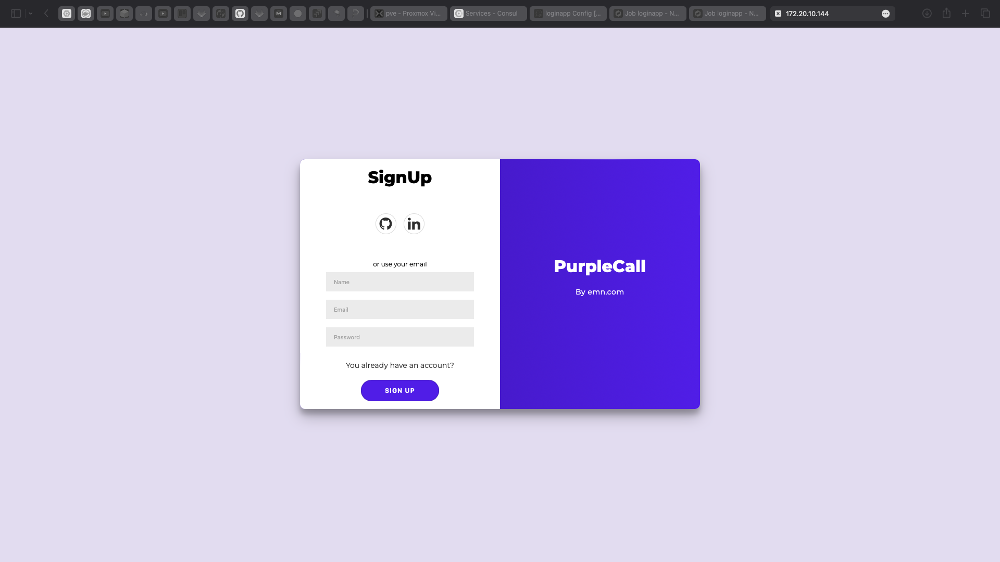
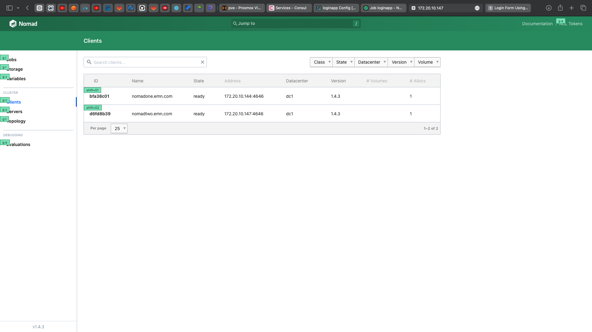
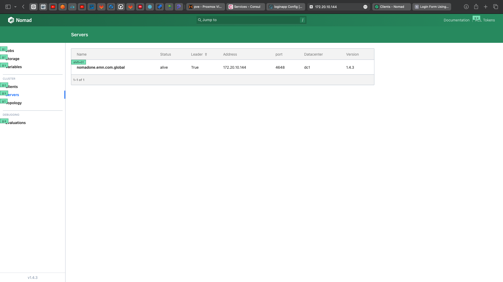

<h3 align="center">Project Title</h3>

  

---

 Springboot application working on nomad cluster.
      

## 📝 Table of Contents
- [About](#about)
- [Deployment](#deployment)
- [Social Links](#sociallinks)

## 🚀 About 

I use my own small Springboot Webapp and Dockerize with Dockerfile (you can see this in this repo). After that, I wrote 

## 🚀 Deployment 

The project has 2 nomads(1 server, 1 client) registered in the consul server with consul agents inside the nomads. Webapp deployed to nomad server and nomad server creates a job on own and client node. I used Jenkins pipeline to create a docker image and push it to the repository automatically. 

## 🎉 Social Links 

